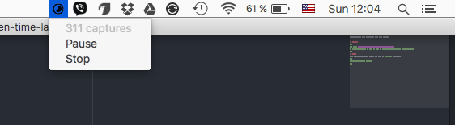

# Screen time-lapse
Simple util to make time-lapse from your screen.

## Install
```
git clone https://github.com/fullpipe/screen-time-lapse
cd screen-time-lapse && make && sudo cp ./bin/screen-time-lapse /usr/local/bin/
```
## Usage
Make a screenshot every 5 seconds and save to `./today` directory.
```
screen-time-lapse -every 5 -to ./today
```


### Todo
* make it work not only in unix systems
* add image sequence to video converter

### Credits
[goanigiffy](https://github.com/srinathh/goanigiffy)
